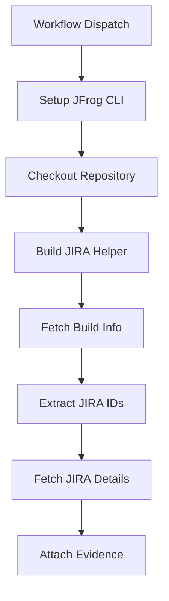

# Jira Ticket Tracking Evidence Example

This repository provides a GitHub Actions workflow that automates Jira ticket tracking and validation. It extracts Jira ticket IDs from VCS messages, validates their existence, and attaches the results as signed evidence to JFrog Artifactory.

## Key Features

* **Automated Extraction**: Extracts Jira IDs from VCS messages in build info
* **Ticket Validation**: Validates tickets exist and retrieves their status
* **Transition History**: Captures complete workflow transitions
* **Signed Evidence**: Attaches results to Artifactory with cryptographic signatures
* **No Git Dependencies**: Works directly from build info without repository access
* **Markdown Reports**: Generate human-readable reports from JIRA data

## Workflow Overview



## Prerequisites

* JFrog CLI 2.65.0+ (installed by workflow)
* Artifactory repository with build info
* Private key configured in JFrog Platform
* JIRA Cloud API access
* Go 1.21+ (for building helper)

## Configuration

### GitHub Secrets

| Secret | Description |
|--------|-------------|
| `ARTIFACTORY_ACCESS_TOKEN` | JFrog Access Token with read/write permissions |
| `PRIVATE_KEY` | Private key for signing evidence |
| `JIRA_USERNAME` | JIRA user account for API |
| `JIRA_API_TOKEN` | JIRA API token |

### GitHub Variables

| Variable | Description | Example |
|----------|-------------|---------|
| `ARTIFACTORY_URL` | JFrog Platform URL | `https://mycompany.jfrog.io` |
| `JIRA_URL` | JIRA instance URL | `https://mycompany.atlassian.net` |
| `EVIDENCE_KEY_ALIAS` | Public key alias for verification | `my-signing-key` |

## Usage

### Running the Workflow

1. Go to **Actions** tab in your repository
2. Select **Create Jira evidence** workflow
3. Click **Run workflow**
4. Enter required inputs:
   - **build_name**: Build name in Artifactory
   - **build_number**: Build number in Artifactory

The workflow will:
1. Fetch build info from Artifactory
2. Extract JIRA IDs from VCS messages
3. Query JIRA API for ticket details
4. Generate both JSON and markdown reports
5. Display markdown summary in GitHub Actions
6. Attach signed evidence to the build (including markdown if available)

### Output Example

The workflow produces a JSON file with JIRA ticket details:

```json
{
  "tasks": [
    {
      "key": "EV-123",
      "link": "https://example.atlassian.net/browse/EV-123",
      "status": "In Progress",
      "description": "Task description",
      "type": "Task",
      "project": "EV",
      "created": "2020-01-01T12:11:56.063+0530",
      "updated": "2020-01-01T12:12:01.876+0530",
      "assignee": "John Doe",
      "reporter": "Jane Smith",
      "priority": "Medium",
      "transitions": [
        {
          "from_status": "To Do",
          "to_status": "In Progress",
          "author": "John Doe",
          "author_user_name": "john.doe@company.com",
          "transition_time": "2020-07-28T16:39:54.620+0530"
        }
      ]
    }
  ]
}
```

### Markdown Reports

The workflow automatically generates markdown reports from the JIRA data, providing:
- Summary table of all tasks
- Detailed task information with transitions
- Status distribution statistics
- Clickable links to JIRA tickets (automatically included in the data)

This creates human-readable reports for stakeholders and documentation purposes.

## How It Works

1. **Extract from Build Info**: The workflow fetches build information from Artifactory and extracts JIRA IDs from VCS messages using regex patterns (default: `[A-Z]+-[0-9]+`)

2. **Process JIRA Tickets**: The helper application queries JIRA API for each ticket ID and collects status, transitions, and metadata

3. **Generate Reports**: The workflow automatically generates both JSON and markdown reports from the JIRA data

4. **Create Evidence**: Results are attached to the build as signed evidence, including both the JSON data and markdown report

5. **Workflow Summary**: The markdown report is displayed in the GitHub Actions workflow summary for easy viewing

## Workflow Features

### Automatic Markdown Generation
The workflow automatically generates a markdown report after fetching JIRA details, providing:
- Human-readable summary of all JIRA tickets
- Full transition history in table format
- Status distribution statistics
- Direct viewing in GitHub Actions summary

### Evidence with Markdown
The evidence creation includes the markdown report using the `--markdown` option:
- Both JSON and markdown are attached to the same evidence entry
- The markdown provides human-readable context alongside machine-readable JSON
- No separate evidence entries needed

## Error Handling

* **Invalid IDs**: Skipped with warning
* **Non-existent Tickets**: Marked as "Error" in output
* **API Failures**: Logged with error details
* **Empty Results**: Workflow continues with empty evidence

## Technical Details

For detailed information about the JIRA helper tool including command-line options, environment variables, building instructions, and API integration, see the [helper directory README](helper/README.md).

## References

* [JIRA REST API](https://developer.atlassian.com/cloud/jira/platform/rest/v3/)
* [JFrog Evidence Management](https://jfrog.com/help/r/jfrog-artifactory-documentation/evidence-management)
* [JFrog CLI](https://jfrog.com/getcli/)